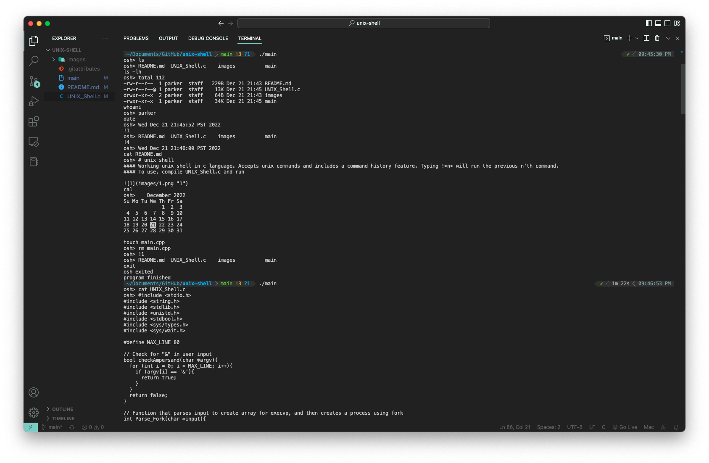

# unix shell
#### Working unix shell in c language. Accepts unix commands and includes a command history feature. Typing !<n> will run the previous n'th command. 
#### To use, compile UNIX_Shell.c and run

